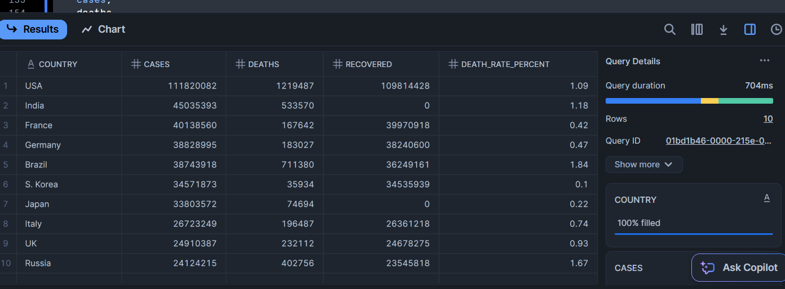

# COVID-19 Data Pipeline with S3 and Snowflake

This project demonstrates a real-time data pipeline that extracts COVID-19 data from a public API, stores it in AWS S3, and loads it into Snowflake for analytics, built entirely using free-tier resources.

---

## Problem Statement

Automate the ingestion of daily COVID-19 data for all countries from a public API, store the raw data in Amazon S3, and load it into a Snowflake cloud data warehouse for querying and analytics.

---

## Tech Stack

- **Python**: Data extraction and upload scripts
- **AWS S3** (Free Tier): Cloud storage for raw data
- **Snowflake** (Trial): Cloud data warehouse for querying
- **REST API**: `https://disease.sh/v3/covid-19/countries`
- *(Optional)* **Apache Airflow**: Can be added for orchestration

---

## Project Structure

```
covid_data_pipeline/
├── venv/                        # Python virtual environment
├── dags/                        # Airflow DAGs (optional)
├── scripts/                     # Python scripts
│   ├── extract_covid_data.py    # Pulls COVID data from API
│   └── upload_to_s3.py          # Uploads CSV to S3
├── data/                        # Stores generated CSVs
│   └── covid_countries_data.csv
├── include/
│   └── config.env               # AWS/Snowflake credentials (excluded from repo)
├── .gitignore
└── README.md
```


---

## Pipeline Steps

1. **Extract**: Pull real-time COVID-19 data for 200+ countries using a public API
2. **Transform**: Normalize and flatten JSON into tabular format (via pandas)
3. **Store**: Save data to `covid_countries_data.csv`
4. **Upload**: Push CSV to AWS S3 (`raw_data/` folder)
5. **Ingest**: Use Snowflake `COPY INTO` to load into a raw staging table
6. **Clean**: Insert selected fields into final `covid_by_country` table
7. **Query**: Perform analysis in Snowflake

---

## Sample SQL Query

```sql
SELECT 
    country, 
    cases, 
    deaths, 
    recovered, 
    ROUND(deaths::FLOAT / cases * 100, 2) AS death_rate_percent
FROM covid_by_country
ORDER BY cases DESC
LIMIT 10;

```


## Sample Output

| country      | cases      | deaths    | recovered  | death_rate_percent |
|--------------|------------|-----------|------------|---------------------|
| USA          | 103M+      | 1.1M+     | 102M+      | 1.12                |
| India        | 44.9M+     | 531K+     | 44.3M+     | 1.18                |
| Brazil       | 37M+       | 700K+     | 36M+       | 1.89                |
| Russia       | 22.5M+     | 400K+     | 22M+       | 1.78                |


---

## Security Notes
.env files and credentials are excluded using .gitignore

Snowflake and S3 are accessed using IAM credentials in a safe config file

For production, consider switching to role-based access or Snowflake external stages


---

## What I Learned
Working with REST APIs and Normalizing nested JSON data for multiple entities (countries)

Staging and transforming data in Snowflake

Integrating cloud services into reproducible pipelines

Preparing clean, query-ready datasets for downstream use

---

## Snowflake Output

Below is a sample output after loading and querying the data from Snowflake:



